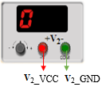
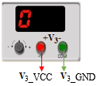
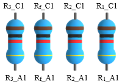
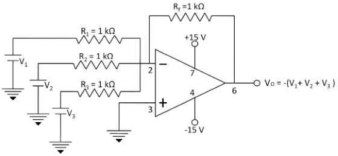
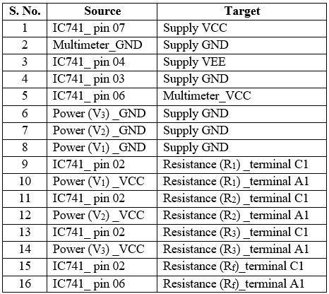
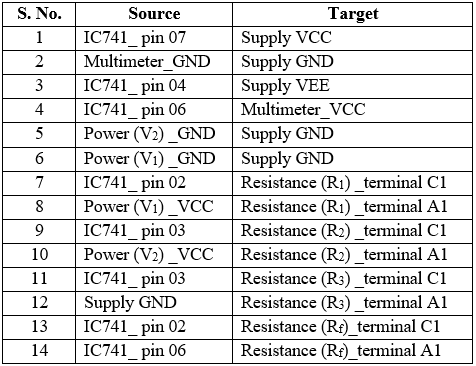
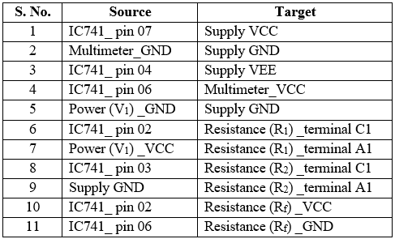

## Procedure 
#### Familiarise with components

   

&emsp; &emsp; &emsp; &emsp; &emsp; &emsp; &emsp;   

**Fig 1: Components**

### **A.** Addition

**1.** Click on the component button to place the component on the table.  
**2**. Make connections as per the circuit diagram or connection table.

  

 

**Fig 2: Circuit diagram for addtion.**

**Table 1: Connection table for addtion.**

  

**3.** Click on **'Add to table'** button and calculate the output voltage using the formula mentioned in the figure/instructions of respective simulator to add calculations to the table.

### **B.** Subtraction

**1.** Click on the component button to place the component on the table.  
**2**. Make connections as per the circuit diagram or connection table.

    

 

**Fig 3: Circuit diagram for subtraction.**

**Table 2: Connection table for subtraction.**

  

**3.** Click on **'Add to table'** button and calculate the output voltage using the formula mentioned in the figure/instructions of respective simulator to add calculations to the table.

### **C.** Multiplication by constant ( and Division when Rf < Ri)

**1.** Click on the component button to place the component on the table.  

 
  
&emsp; &emsp; &emsp; &emsp; &emsp; &emsp; &emsp;   

**Fig 4: Components**

**2**. Make connections as per the circuit diagram or connection table.

  

 

**Fig 5: Circuit diagram for multiplication/division by a constant.**

**Table 3: Connection table for multiplication/division by a constant.**

**3.** Click on **'Add to table'** button and calculate the output voltage using the formula mentioned in the figure/instructions of respective simulator to add calculations to the table.

 
